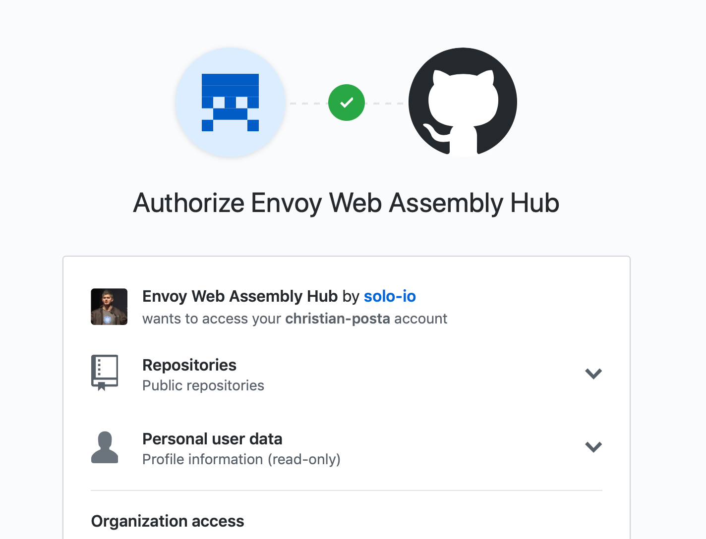

In this tutorial, we will:
1 - Create a user on [`https://webassemblyhub.io`](https://webassemblyhub.io) push a WASM image to `yuvaltest.solo.io`. 
1 - Pushing to an org. 

In this tutorial we will create an Envoy filter in C++ and build it using WASME. We'll optionally push
the image to the public WASM registry at https://webassemblyhub.io/.

## Creating a new WASM module

Refer to the [installation guide]() for installing `wasme`, the WebAssembly Hub CLI.

Let's create a new project called `new-filter`:

```shell
$  wasme init ./cpp-filter
```

You'll be asked with an interactive prompt which language platform you are building for. Choose the 
appropriate option below:



? What language do you wish to use for the filter:
  ▸ cpp
? With which platform do you wish to use the filter?:
  ▸ istio 1.5.x
  ▸ gloo 1.3.x


? What language do you wish to use for the filter:
  ▸ cpp
? With which platform do you wish to use the filter?:
  ▸ gloo 1.3.x



We should now have a new folder with our new project:

```shell
$  cd new-filter
$  ls -l 
-rw-r--r--  1 ceposta  staff    572 Dec 10 09:06 BUILD
-rw-r--r--  1 ceposta  staff    505 Dec 10 09:06 README.md
-rw-r--r--  1 ceposta  staff   2782 Dec 10 09:06 WORKSPACE
drwxr-xr-x  3 ceposta  staff     96 Dec 10 09:06 bazel
drwxr-xr-x  3 ceposta  staff     34 Dec 10 09:06 filter-config.json
-rw-r--r--  1 ceposta  staff   2797 Dec 10 09:06 filter.cc
-rw-r--r--  1 ceposta  staff     60 Dec 10 09:06 filter.proto
drwxr-xr-x  7 ceposta  staff    224 Dec 10 09:06 toolchain
```

Open this project in your favorite IDE. The source code is C++ and we'll make some changes to create a new filter.

## Making changes to the sample filter

Feel free to explore the project that was created. This is a Bazel project that sets up the correct emscripten toolchain to build C++ into WASM. Let's open ./new-filter/filter.cc in our favorite IDE.

Navigate to the `FilterHeadersStatus AddHeaderContext::onResponseHeaders` member method. Let's add a new header that we can use to verify our module was executed correctly (later down in the tutorial). Let's add a new response header named `doc-header`:

```code
addResponseHeader("doc-header", "it-worked");
```
Your method should look like this:

```go
FilterHeadersStatus AddHeaderContext::onResponseHeaders(uint32_t) {
  LOG_DEBUG(std::string("onResponseHeaders ") + std::to_string(id()));
  addResponseHeader("newheader", root_->header_value_);
  addResponseHeader("doc-header", "it-worked");
  replaceResponseHeader("location", "envoy-wasm");
  return FilterHeadersStatus::Continue;
}
```

## Building the filter

Now, let's build a WASM image from our filter with `wasme`. The filter will be tagged and stored
in a local registry, similar to how [Docker](https://www.docker.com/) stores images. 

In this example we'll include the registry address `webassemblyhub.io` as well as 
our GitHub username which will be used to authenticate to the registry.

Build and tag our image like so:

```shell
wasme build . -t webassemblyhub.io/ilackarms/add-header:v0.1
```

The module will take up to a few minutes to build. In the background, `wasme` has launched a Docker container to run the necessary 
build steps. 

When the build has finished, you'll be able to see the image with `wasme list`:

```bash
wasme list
```

```
NAME                                     SHA      UPDATED             SIZE   TAGS
webassemblyhub.io/ilackarms/add-header  bbfdf674 26 Jan 20 10:45 EST 1.0 MB v0.1
```

## Optional: Push the filter

In order to make our image available for use with Gloo or Istio, we need to publish it to a public registry. The default 
registry used by `wasme` is `webassemblyhub.io`.

Now that we've built the WASM module, let's publish it into a registry so we can deploy it to our Envoy proxy running in Kubernetes.

To do that, let's login to the `webassemblyhub.io` using GitHub as the OAuth provider. From the CLI:

```shell
$  wasme login

Using port: 60632
Opening browser for login. If the browser did not open for you, please go to:  https://webassemblyhub.io/authorize?port=60632
```

You should see a GitHub OAuth screen:



Click the "Authorize" button at the bottom and continue.

After successful auth, you should see this in the terminal:

```shell
success ! you are now authenticated
```

Now let's push to the webassemblyhub.io registry. 

```shell
$  wasme push webassemblyhub.io/ilackarms/add-header:v0.1
INFO[0000] Pushing image webassemblyhub.io/ilackarms/add-header:v0.1
INFO[0001] Pushed webassemblyhub.io/ilackarms/add-header:v0.1
INFO[0001] Digest: sha256:22f2d81f9b61ebbf1aaeb00aa7bde20a90b90ec8bb5f492cc18a140de205dc32
```

{}
The tag name to use is
`webassemblyhub.io/<your-git-username>/<some-name>:<some-version>`
{}

When you've pushed, you should be able to see your new module in the registry:

```shell
$  wasme list --published  

NAME                        SHA      UPDATED             SIZE   TAGS
ilackarms/add-header        6aef37f3 13 Jan 10 12:54 MST 1.0 MB v0.1
```

## Deploying our new module

For instructions on deploying wasm filters, see [the deployment documentation](../deploy_tutorials)
